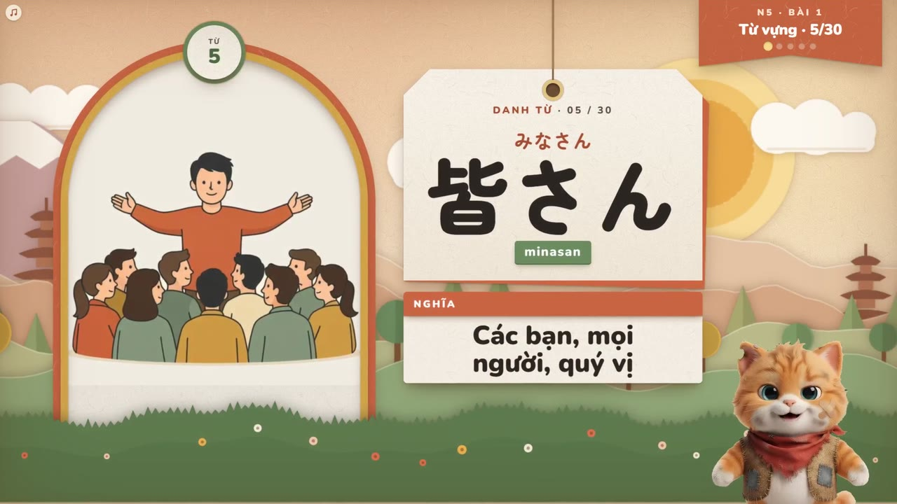
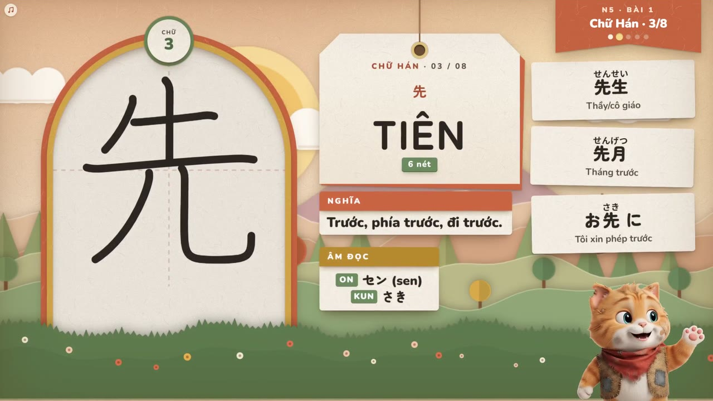
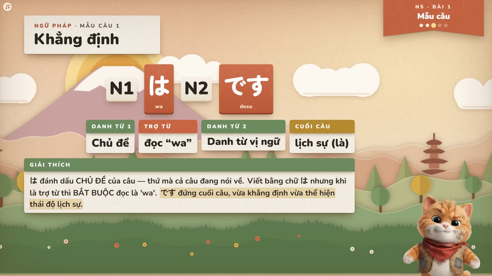
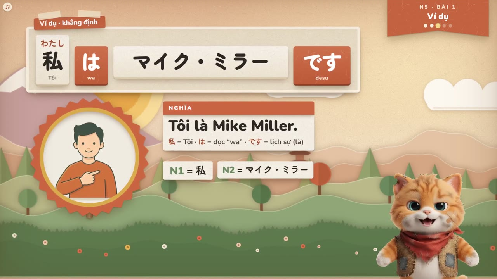
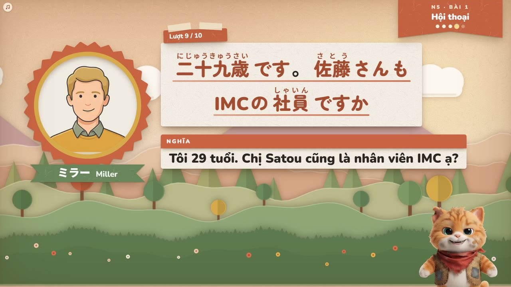
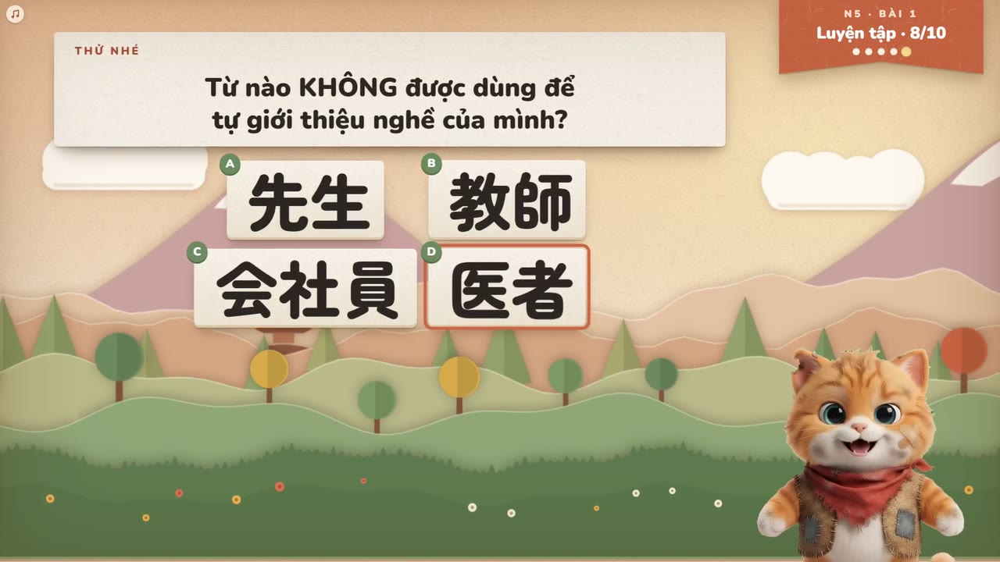

# AI Live Sensei Classroom

**Lớp học tiếng Nhật có giáo viên AI nói chuyện thật, từ nhập môn đến N1.**

Người học nghe Sensei (một chú mèo giáo viên) giảng bằng giọng nói, tự do ngắt lời để hỏi, luyện nói qua micro và được sửa lỗi ngay. Bài giảng chạy trên một "sân khấu" trực quan: chữ, furigana, hình minh họa và hiệu ứng xuất hiện đúng lúc Sensei nhắc tới, giống một video bài học nhưng tương tác được.

> Trạng thái: **bản thử nghiệm đang phát triển tích cực** (prototype chạy được trên máy cá nhân). Chưa phải sản phẩm phát hành đại trà. Mục “Kế hoạch & kinh phí” bên dưới nói rõ cần gì để đi tiếp.

---

## Xem thử

Bài giảng **N5 – Bài 1** chạy ở hai chế độ sân khấu. Sensei (mèo giáo viên) giảng bằng giọng nói; từ đang đọc sáng lên, chữ Hán được viết từng nét, hình minh họa xuất hiện đúng nhịp.

| Chế độ *Bảng đen lớp học* | Chế độ *Giấy cắt lớp* |
|:---:|:---:|
|  |  |

**Video có tiếng** (45 giây, giọng Sensei thật): [Bảng đen lớp học](docs/demo/demo-s.mp4) · [Giấy cắt lớp](docs/demo/demo-h.mp4)

**Các phần của một bài học** (từ trên xuống: từ vựng, chữ Hán, mẫu câu, ví dụ, hội thoại, bài tập):

| Bảng đen lớp học | Giấy cắt lớp |
|:---:|:---:|
|  |  |
|  |  |
|  |  |
|  |  |
|  |  |
|  |  |

> Các hình và clip trên được quay từ chính bài giảng của ứng dụng ở chế độ mô phỏng, với giọng Sensei và giọng nhân vật hội thoại là giọng AI thật. Đây là bản thử nghiệm.

---

## Vấn đề dự án giải quyết

- Người Việt học tiếng Nhật thường phải chọn giữa **giáo trình tĩnh** (rẻ nhưng không có người nói, không sửa lỗi) và **lớp học với giáo viên** (hiệu quả nhưng đắt, khó sắp lịch).
- Ứng dụng học ngôn ngữ phổ biến thiên về trắc nghiệm, ít cho người học **nói và được phản hồi tức thì**.
- Nội dung tiếng Nhật giải thích bằng tiếng Việt, có Hán Việt, có mẹo nhớ cho người Việt còn rất ít.

## Giải pháp

Một lớp học trực tuyến trong đó **AI giọng nói trực tiếp (live voice AI)** đóng vai giáo viên:

1. **Trò chuyện giảng dạy hai chiều bằng giọng nói.** Sensei giảng, người học nói chen vào bất cứ lúc nào; Sensei dừng ngay, trả lời, rồi quay lại bài.
2. **Giảng theo giáo án có cấu trúc.** Sensei đi lần lượt qua từ vựng, chữ Hán, mẫu câu, ví dụ, hội thoại và bài tập, không nói lan man ngoài chủ đề.
3. **Sân khấu bài giảng đồng bộ với lời nói.** Từ nào đang được đọc thì sáng lên; chữ Hán được viết từng nét; hình minh họa và hiệu ứng theo nhịp giảng.
4. **Hội thoại nhiều nhân vật có giọng riêng.** 28 nhân vật trong bài hội thoại, mỗi người một giọng cố định (14 nam, 14 nữ), chân dung nhép miệng theo âm thanh và đổi biểu cảm theo cảm xúc câu thoại.
5. **Luyện nói và sửa lỗi.** Người học nói vào micro, Sensei nhận ra lỗi ngữ pháp/phát âm và hiện bảng sửa lỗi ngay trên bài.

---

## Tính năng đã có

| Mảng | Nội dung |
|---|---|
| **Giáo án** | 110 bài từ **Nhập môn (bảng chữ kana, 10 bài)** đến **N5 (25), N4 (25), N3 (20), N2 (15), N1 (15)**. Từ vựng, chữ Hán (Hán Việt, âm On/Kun, thứ tự nét), mẫu câu, ví dụ, hội thoại và bài tập. Mỗi từ trong câu có `id` riêng để AI trỏ chính xác. |
| **Giảng bằng giọng nói** | Hai chiều, ngắt lời tự nhiên, Sensei điều khiển slide và đánh dấu từ đang nói. Tiếng Việt xen tiếng Nhật đọc đúng ngôn ngữ từng câu. |
| **Hình minh họa** | Hơn **1.500 ảnh** minh họa từ vựng và cảnh bài học do mô hình ảnh mã nguồn mở tạo (giấy phép Apache-2.0), cùng bộ chân dung 28 nhân vật × 8 biểu cảm. |
| **Chân dung nhép miệng** | Miệng nhân vật khớp âm thanh thật, biểu cảm và ngữ điệu theo cảm xúc câu. |
| **Chế độ sân khấu** | Chọn giao diện giảng bài: *Mặc định*, *Giấy cắt lớp* (phong cảnh giấy cắt nhiều lớp) và *Bảng đen lớp học*. Mỗi chế độ có cả màn hình chờ cùng phong cách. |
| **Công cụ dựng video bài học** | Chạy cùng sân khấu ở chế độ mô phỏng và ghép tiếng thật để xuất **video bài giảng đầy đủ** (ví dụ N5 bài 1, khoảng 30 phút, 1080p) — dùng làm nội dung YouTube, còn web là phần học tương tác đi kèm. |
| **Bộ kiểm thử bố cục tự động** | Đo tự động chữ bị cắt, chồng chữ, chữ quá nhỏ, khoảng trống, độ khựng; quét toàn bộ 110 bài ở màn hình máy tính và điện thoại. |

## Điểm khác biệt

- **Dành riêng cho người Việt học tiếng Nhật**: giải thích bằng tiếng Việt, Hán Việt, mẹo nhớ.
- **Nói và nghe là trung tâm**, không chỉ trắc nghiệm.
- **Một nguồn nội dung, hai kênh**: cùng giáo án tạo ra buổi học tương tác trên web và video bài giảng cho kênh nội dung.
- **Chi phí nội dung thấp**: hình minh họa dùng mô hình mã nguồn mở, giáo án sinh theo dữ liệu có cấu trúc.

---

## Kế hoạch & kinh phí

Đây là dự án cá nhân đang ở giai đoạn thử nghiệm. Các hạng mục cần nguồn lực để tiến tới bản người dùng thật:

| Hạng mục | Mô tả |
|---|---|
| **Hạ tầng và chi phí AI giọng nói** | Mỗi giờ học trực tiếp tiêu tốn dịch vụ AI giọng nói theo thời gian thực; cần ngân sách để thử nghiệm với nhóm người học đầu tiên. |
| **Máy chủ và bảo mật** | Chuyển từ máy chủ phát triển (chỉ chạy trên máy cá nhân) sang dịch vụ triển khai thật: tài khoản người dùng, giới hạn sử dụng, không để lộ khóa dịch vụ. |
| **Nội dung** | Hoàn thiện, kiểm duyệt giáo án với giáo viên tiếng Nhật; mở rộng bài luyện nghe/nói và bộ đề theo JLPT. |
| **Hình ảnh và video** | Tạo và kiểm duyệt thêm hình minh họa; sản xuất loạt video bài giảng cho cả 110 bài. |
| **Thử nghiệm với người học** | Chạy thử với nhóm nhỏ, đo mức độ học được và điều chỉnh. |
| **Thiết bị di động** | Hoàn thiện trải nghiệm trên điện thoại (đã có bố cục điện thoại, cần thử trên nhiều máy). |

Nếu bạn muốn tài trợ, hợp tác nội dung hoặc thử nghiệm với học viên, vui lòng liên hệ qua GitHub của dự án: [github.com/trituenguyen97](https://github.com/trituenguyen97).

---

## Chạy thử trên máy của bạn

Yêu cầu: Python 3, trình duyệt Chrome/Edge hiện đại, micro (nếu muốn nói).

```bash
# 1) Tải thư viện giao diện (chỉ làm một lần sau khi clone)
python tools/setup_vendor.py

# 2) Tạo file cấu hình chứa khóa dịch vụ AI giọng nói
cp .env.example .env
#   mở .env và điền khóa theo chú thích trong file

# 3) Chạy máy chủ phát triển
python server.py
#   rồi mở http://localhost:3000
```

Hoặc trên Windows: bấm đúp `start.bat`.

**Xem thử không cần khóa và không tốn chi phí**: mở `http://localhost:3000/?noLive&moPhong` để chạy bài giảng ở chế độ mô phỏng (tiếng tổng hợp giả, không gọi dịch vụ AI). Thêm `&phongCach=h` (Giấy cắt lớp) hoặc `&phongCach=s` (Bảng đen) để chọn chế độ sân khấu.

> ⚠️ Máy chủ này chỉ để phát triển, mặc định chỉ nghe trên `127.0.0.1`. **Không** mở ra internet và **không** dùng các máy chủ tĩnh phục vụ cả thư mục dự án (sẽ lộ file `.env`). `.env` và `env.js` luôn nằm ngoài git.

## Cấu trúc thư mục

```
index.html            Giao diện lớp học
css/  js/             Giao diện, bộ điều khiển bài giảng, âm thanh, sân khấu (js/che-do/ = các chế độ sân khấu)
curriculum/           Giáo án: kana, n5 … n1 (mỗi bài một tệp JSON), nhân vật và giọng hội thoại
assets/               Hình minh họa, chân dung nhân vật, nền chế độ sân khấu
tools/                Công cụ dựng giáo án, kiểm thử bố cục (tools/che-do/), dựng video bài học (tools/che-do/video/), quy trình tạo ảnh (tools/anh-ai/)
docs/che-do/          Tài liệu thiết kế và quy trình phát triển chế độ sân khấu
server.py  start.bat  Máy chủ phát triển và lệnh chạy nhanh trên Windows
```

## Giấy phép và ghi chú

- Hình minh họa do mô hình mã nguồn mở (Apache-2.0) tạo; chi tiết quy trình ở `tools/anh-ai/`.
- Dự án chưa kèm tệp giấy phép phần mềm; liên hệ tác giả nếu muốn sử dụng lại mã nguồn.
