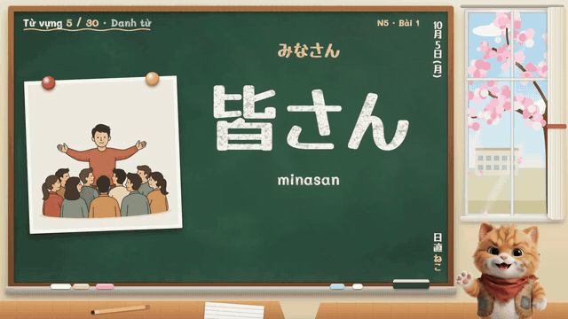
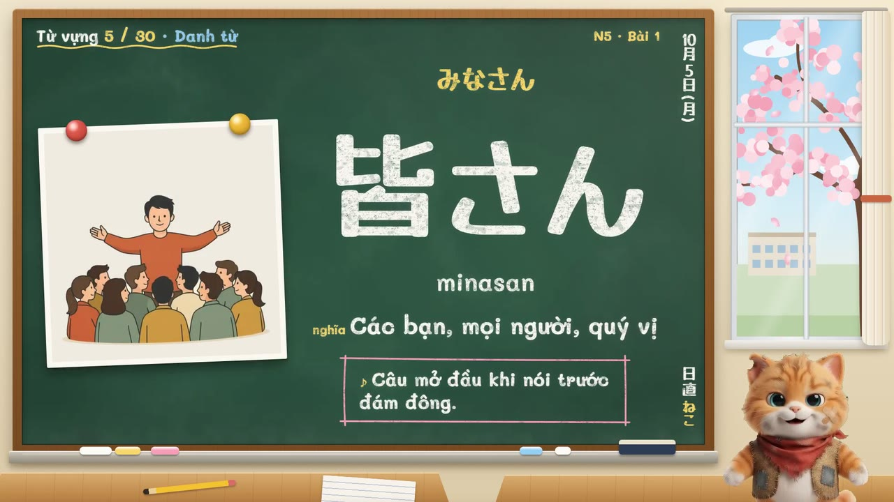
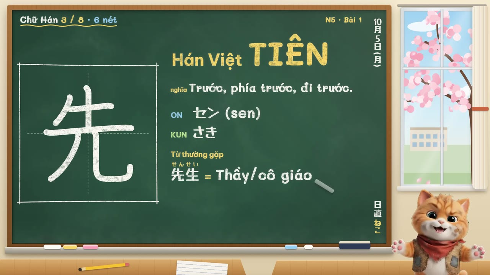
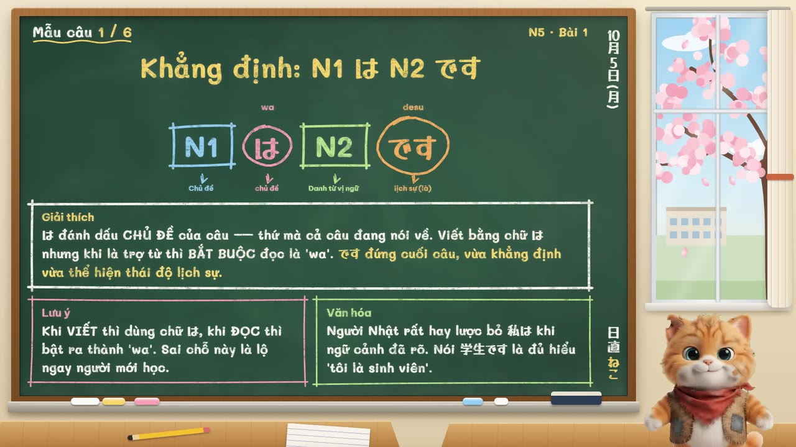
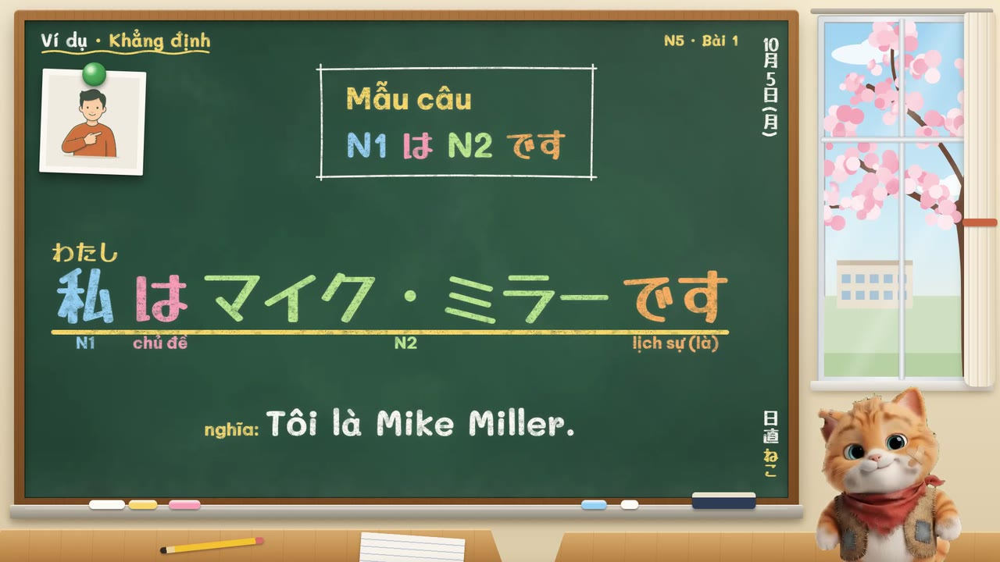
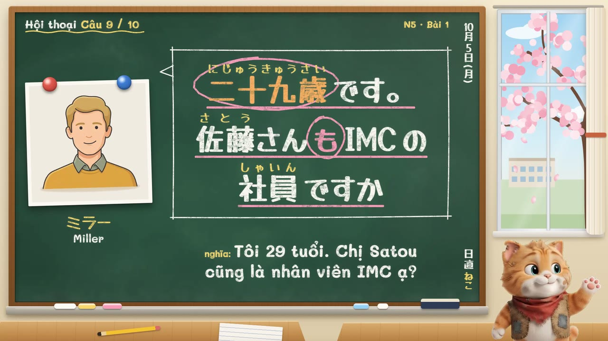
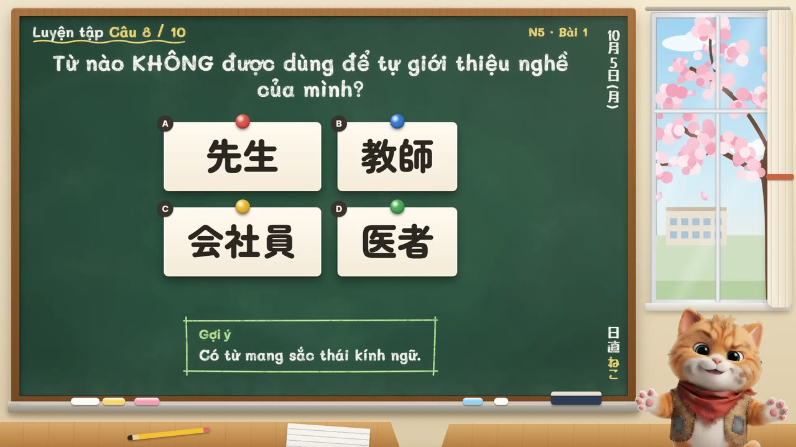

# AI Live Sensei Classroom

> **Autonomous Real-Time Multimodal Voice AI Sensei & Interactive Classroom (Introductory Kana → N1)**  
> *A grant-seeking, open-source EdTech initiative bringing synchronous 1-on-1 human-grade language tutoring to millions.*

[](LICENSE)
[](README.md)
[-success.svg)](curriculum/)
[](docs/che-do/)

---

## 🌟 Executive Summary & Pitch

Traditional language acquisition suffers from a stark market dilemma: **static self-study apps** (gamified quizzes, flashcards) lack authentic conversational immersion, cannot evaluate speech in conversational context, and cannot handle fluid questions; conversely, **private 1-on-1 native tutors** cost $30–$60 per hour, rendering fluent conversational training inaccessible to most students.

**AI Live Sensei Classroom** bridges this chasm by delivering an **autonomous, full-duplex interactive classroom** right in the browser. Powered by low-latency bidirectional multimodal audio streaming, an AI teacher avatar ("Sensei") leads structured lessons with live voice synthesis, synchronizes visual slides and Kanji stroke orders in real time, allows students to interrupt naturally via voice (sub-second barge-in VAD), and dynamically detects and corrects grammatical errors on the fly.

> **Status:** Active prototype running locally. A working end-to-end implementation with 110 structured lessons, live voice interaction, and multi-character roleplay. Seeking grant funding and educational partnerships to advance to hosted multi-tenant deployment.

```
       ┌────────────────────────────────────────────────────────┐
       │             Browser Client (Web Audio API)             │
       │  Microphone (PCM 16kHz) ◄───► Audio Output (PCM 24kHz) │
       │  Dynamic Canvas / DOM    │    Chalkboard / PaperCut    │
       └───────────▲────────────────────────────▲───────────────┘
                   │  Bidi WebSocket Stream     │
                   ▼                            │ DOM Action Dispatches
       ┌────────────────────────────────────────┴───────────────┐
       │             Real-Time Multimodal Voice Engine          │
       │  • Sub-second Barge-in Voice Activity Detection (VAD)  │
       │  • Interleaved Pedagogical Reasoning (Thinking Stream) │
       │  • Autonomous Tool Calling:                            │
       │      - change_slide(level, lesson, index)              │
       │      - highlight_element(id, style, comment)           │
       │      - mark_error(wrong, corrected, explanation)       │
       └────────────────────────────────────────────────────────┘
```

---

## 🎬 Live Demonstrations & Stage Engines

Lessons run on an interactive visual stage where spoken words light up in sync, Kanji strokes render stroke-by-stroke, and contextual illustrations animate seamlessly with Sensei's voice.

| Classroom Blackboard Engine (*Bảng đen lớp học*) | Layered Paper-Cut Engine (*Giấy cắt lớp*) |
|:---:|:---:|
|  |  |
| [Watch Video Demo with Voice (45s)](docs/demo/demo-s.mp4) | [Watch Video Demo with Voice (45s)](docs/demo/demo-h.mp4) |

### 6-Stage Structured Pedagogical Flow
Every lesson systematically guides the learner through 6 structured learning sections:

| 1. Vocabulary (*Từ vựng*) | 2. Kanji Stroke Order (*Chữ Hán*) | 3. Sentence Patterns (*Mẫu câu*) |
|:---:|:---:|:---:|
|  |  |  |
| **4. Conversational Examples** | **5. Roleplay Dialogue (28 Avatars)** | **6. Interactive Drills & Exercises** |
|  |  |  |

---

## 🚀 Key Features & Architectural Innovations

### 1. Bidirectional Real-Time Audio Streaming (Full-Duplex)
- **Audio Capture:** Downsamples browser microphone input into mono 16-bit PCM at 16kHz, streaming binary chunks over persistent WebSocket via `realtimeInput.mediaChunks`.
- **Audio Playback:** Consumes native 24kHz PCM audio chunks from the voice engine, converted to Float32 and scheduled without gaps or clicks via Web Audio API.

### 2. Sub-Second Conversational Barge-In (Natural Interruption)
- When the learner speaks while Sensei is talking, the Voice Activity Detection engine triggers an immediate `serverContent.interrupted: true` signal.
- The client-side audio engine instantly cancels queued audio buffers and resets playback timelines, enabling natural, human-like turn-taking.

### 3. Interleaved Pedagogical Reasoning
- Displays Sensei's internal pedagogical analysis (`parts[].thought`) in real-time before spoken answers are formulated, clarifying *why* a particular correction or teaching strategy was chosen.

### 4. Autonomous Function Calling (DOM Stage Control)
Sensei acts as an agent in control of the classroom through structured function calling:
- `change_slide(level, lesson_id, slide_index)`: Navigates slides according to learner mastery.
- `highlight_element(target_id, style_type, comment)`: Highlights vocabulary (neon yellow), grammar structures (neon cyan), or cautionary exceptions (warning red) using token-level DOM IDs.
- `mark_error(wrong_phrase, corrected_phrase, explanation)`: Immediately launches an error correction card showing exact diffs and structural explanations.

### 5. Multi-Character Roleplay with Audio-Driven Lip Sync
- **28 Distinct Characters** (14 female, 14 male) with dedicated persona voices.
- Real-time procedural lip syncing synced with audio amplitude, complemented by 8 emotional facial expressions responding dynamically to conversational sentiment.

### 6. Comprehensive 110-Lesson Curriculum (Kana → N1)
- Structured JSON curriculum spanning **Introductory Kana (10 lessons)**, **N5 (25 lessons)**, **N4 (25 lessons)**, **N3 (20 lessons)**, **N2 (15 lessons)**, and **N1 (15 lessons)**.
- Token-level ID tagging (`tok-*`, `ex-*`) enabling precision highlighting of individual Kanji, Furigana ruby annotations, and grammatical particles.
- Over **1,500+ context-specific lesson illustrations** generated using open-source Apache-2.0 visual generative models.

### 7. Dual-Channel Content Engine: Web + 1080p Video Generation
- Includes an automated video production pipeline (`tools/che-do/video/`) that drives the web stage in simulated mode with synthetic studio audio, exporting broadcast-quality 1080p full-length video lectures (e.g., YouTube channels) while reusing the exact same curriculum data.

### 8. Automated UI & Cross-Device Layout Testing Suite
- Headless automated regression suite (`tools/che-do/khung/`) measuring text truncation, overlap, layout shift, and readability across both desktop and mobile viewports for all 110 lessons.

---

## 🛠️ Project Structure

```
ai-live-sensei-classroom/
├── index.html                   # Core classroom interface & stage canvas
├── css/
│   └── styles.css               # Neon glows, Ruby Furigana, waveform animations
├── js/
│   ├── app.js                   # Main application controller & UI orchestrator
│   ├── live-client.js           # Full-duplex WebSocket voice streaming client
│   ├── audio-engine.js          # Web Audio API 16kHz In / 24kHz Out pipeline
│   ├── slide-engine.js          # Interactive slide rendering & token DOM highlighter
│   ├── curriculum-loader.js     # Structured curriculum loader (Kana -> N1)
│   └── che-do/                  # Stage engines (Chalkboard, PaperCut, Modern)
├── curriculum/                  # 110 structured lesson manifests with token IDs
│   ├── kana.json, n5.json, n4.json, n3.json, n2.json, n1.json
│   └── characters.json          # 28 dialogue characters & voice profiles
├── assets/                      # 1,500+ illustrations, character rigs, textures
├── tools/
│   ├── setup_vendor.py          # Dependency packager
│   ├── che-do/video/            # Automated 1080p video lecture generation pipeline
│   ├── che-do/khung/            # Automated layout regression test suite
│   └── anh-ai/                  # Generative illustration pipeline
├── server.py                    # Local development server with strict MIME types
└── start.bat                    # Windows 1-click launcher
```

---

## ⚡ Getting Started

### Prerequisites
- Python 3.10+
- Modern Web Browser (Google Chrome or Microsoft Edge recommended)
- Microphone (for real-time speech input)
- AI API Access Key (configured via `AI_API`)

### Installation & Launch

```bash
# 1. Clone repository
git clone https://github.com/trituenguyen97/ai-live-sensei-classroom.git
cd ai-live-sensei-classroom

# 2. Download and verify frontend vendor assets
python tools/setup_vendor.py

# 3. Configure environment
cp .env.example .env
# Edit .env and set your AI_API key:
# AI_API=your_api_key_here

# 4. Start local development server
python server.py
```

Or on Windows: double-click **`start.bat`**. Open **`http://localhost:3000`** in your browser.

> **Zero-Cost Simulation Mode:** You can explore the entire classroom without an API key by appending simulation flags:  
> `http://localhost:3000/?noLive&moPhong&phongCach=s` (Classroom Blackboard)  
> `http://localhost:3000/?noLive&moPhong&phongCach=h` (Paper Cutout)

---

## 🎯 Startup Vision, Grant Objectives & Roadmap

We are seeking **grant funding, compute sponsorship, and academic research partnerships** to transition this working prototype into an enterprise-ready educational platform.

### Planned Resource Allocation

```
                   ┌───────────────────────────────────────┐
                   │        Target Grant Allocation        │
                   ├──────────────────┬────────────────────┤
                   │ Real-time Voice  │                    │
                   │ API Compute      │        40%         │
                   ├──────────────────┼────────────────────┤
                   │ Cloud Backend &  │                    │
                   │ Production Auth  │        25%         │
                   ├──────────────────┼────────────────────┤
                   │ Pedagogical &    │                    │
                   │ Native QC        │        20%         │
                   ├──────────────────┼────────────────────┤
                   │ Mobile PWA &     │                    │
                   │ Offline Sync     │        15%         │
                   └──────────────────┴────────────────────┘
```

1. **Voice AI Cloud Compute (40%):** Subsidizing real-time voice streaming sessions for pilot cohorts (students preparing for JLPT N5–N1).
2. **Production Cloud Architecture (25%):** Migrating from local developer server to a secure multi-tenant architecture with user progress tracking, session rate limiting, and secure key vaults.
3. **Pedagogical Validation & Native Teacher Review (20%):** Partnering with accredited Japanese language institutions and native linguists to audit and refine curriculum edge-cases.
4. **Mobile Optimization & PWA (15%):** Finalizing responsive mobile touchscreen interactions for learning on Android & iOS devices.

### Grant Fit
- **EdTech AI Innovation & Open Educational Resources (OER) Grants**
- **AI Accessibility & Cross-Cultural Language Learning Funds**
- **Cloud Infrastructure & AI Research Acceleration Grants**

---

## 🤝 Contact & Partnership

We welcome inquiries from grant foundations, angel investors, EdTech accelerators, and university language departments:

- **Founder & Maintainer:** Tri Tue Nguyen ([@trituenguyen97](https://github.com/trituenguyen97))
- **GitHub Organization:** [https://github.com/trituenguyen97](https://github.com/trituenguyen97)
- **Discussion / Sponsorship:** Please open an issue or initiate a GitHub Sponsor inquiry.
